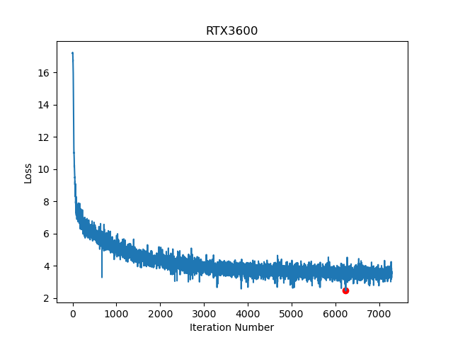

# GPT-2 CRAMMING
### ~ training GPT-2 in one day in a single GPU ~
## Overview
Inspired by the recent paper on training a LLM(BERT) on a single GPU in one day(https://arxiv.org/abs/2212.14034), we decided to apply the same cramming method on the GPT-2 model. 
The goal of this project is to verify the result of the CRAMMING paper and examine whether similar modification would have an effect on the GPT-2 model and improve its training speed.
We used nanoGPT(https://github.com/karpathy/nanoGPT) written by Kaparthy as our baseline GPT-2 model and compared our modified model for performance improvement.



| GPU | flops | Model flops Utilization | loss |
| -------- | -------- | -------- | -------- |
| RTX3060 | 12.74e12 | 66% | 3.55 |
| RTX3060 ti | Row 2, Column 2 | Row 2, Column 3 | Row 2, Column 4 |
| RTX3090 | 35.58e12 | 64% | 3.32 |

#loss is taken by averaging last 200 iterations
## MODIFYING THE ARCHITECTURE
All the changes are based on how BERT(120M) was modified in the CRAMMING paper. Since MLM and Generative models are not the same, some of the changes might not lead to performance improvement. We have not tested this through ablation study due to the constraint of compute budget.

**Attention block** 
- We disable all QKV biases

**Feedforward block**
- We disabled all linear layer biases
- We re-ordered the block into a gated linear unit(GLU), We do not increase the number of parameters in the FFN block to compensate for the halving of the hidden dimensionality due to gating.

**Embedding**
- scaled sinusoidal positional encoder
- We include a layer normalisation at the end of the encoding block.

**Layer structure** 
- As observed in many studies, we use pre-normalization with Layer Norms over post Layer Norm

**Head Block**
- We dropped the decoder bias 
- We add a final Layer Norm to stabilise training further.

## MODIFYING THE TRAINING SETUP
**Training parameters** 

```
# adamw optimizer
learning_rate = 1e-3 # max learning rate
max_iters = 600000 # total number of training iterations
weight_decay = 1e-2
beta1 = 0.9
beta2 = 0.98
eps=10e-12
grad_clip = 0.5 # clip gradients at this value, or disable if == 0.0

# learning rate decay settings
decay_lr = True # whether to decay the learning rate
warmup_iters = 2000 # how many steps to warm up for
lr_decay_iters = 600000 # should be ~= max_iters per Chinchilla
min_lr = 1e-4 # minimum learning rate, should be ~= learning_rate/10 per Chinchilla
optimal_batch_size = 1536 # from CRAMMING paper training BERT(120M)
batch_size =  # if gradient_accumulation_steps > 1, this is the micro-batch size. This varies depending on the machine you are using
gradient_accumulation_steps = optimal_batch_size // batch_size  # used to simulate larger batch sizes
```

**Choice of Optimizer**
We use AdamW like in GPT but with the CRAMMING parameters (note that nanoGPT does not specify an epsilon value hence the default torch value of 1e-8 is used in their work).


**Learning rate scheduling**
As you can see from the diagram in CRAMMING, learning scheduling using warmup and cooldown resulted in the lowest loss. The baseline GPT-2 had the max learning rate as 6e-4. However, the CRAMMING paper applied normalisation in model architecture to enhance model stability and it is using a more aggressive learning rate which is 1e-3.


**Batch Size**
Depending on the hardware you use, the batch size varies. However, you can simulate this to the value you want by using gradient accumulation. In that way, you can restrict the training pipeline from doing back propagation unnecessarily. We set our optimal batch size to be the same as in the CRAMMING paper, 1536. 

Optimal batch size = batch size x gradient accumulation

**Dropping dropout** 
While dropout can be helpful as a regularizer, dropout effectively reduces the number of gradient updates seen by each parameter, as updates do not occur when the associated feature is dropped. At the same time, update runtime is not strongly affected by the presence of dropout, and so dropout results in a net reduction in updates per second.


## OPTIMISING THE DATASET
CRAMMING mentioned that training on more frequent tokens results in faster training. However, we did not apply this in our experiment as the dataset is sufficiently optimised through Byte Pair Encoding(BPE). BPE enables the encoding of any rare words in the vocabulary with appropriate subword tokens without introducing any “unknown” tokens. BPE also flattens the frequent tokens and rare tokens.

## Model parameters
Due to the modification of model architecture, model parameters are reduced from 120M to 109.48M. This largely came from switching GELU to gated linear unit(GLU) and from positional embeddings to sinusoidal positional encoder

**Model config** 

```
class GPTConfig:
    block_size: int = 1024
    vocab_size: int = 50304   
    n_layer: int = 12
    n_head: int = 12
    n_embd: int = 768
    dropout: float = 0.0 # no dropout
    bias: bool = False
```
## fine-tuned result on Shakespeare dataset
```
Ramsay;

Ramsay:
Their tongues have bowled and blistered and
The earth, the king,
The gods, the children, the great,
The children of the house; the dead, the angels,
And so forth, the gods of England,
And the children of England, and, when they have drowned, cried,
And so forth, And so forth,
The great sea, of England, in the heart of England:

The heart of England,
The sea, the heart of England,
The sea, the earth, the earth,
The sea, the sea, the sea,
The sea, the sea, the sea, the sea, the sea.

Ramsay:
And you do have to say.

Ramsay:
That you say your words: "Ramsay, we must make one thing,
And think we must have one thing,
This sound of your word: "Ramsay, we must make one thing,
And think our word, and you speak one thing
For one thing,
And a good thing, say we must never make an instrument
And that would not be my lord."

Ramsay:
I think, your lord, now how the Lord of England has made the way,
And you cannot grant a wife,
And he cannot tell this,
And, you have heard, the king,
And made the last wife,
And made the last wife,
And made her no lord; where I have had not
The greatest sea, which you have known
The true king, that we have heard,
And give the servant, because it is his wife,
And when we have heard,
To hear you, but hear him, and hear him, and tell him,
And tell him, and give him my word,
And tell him, and tell him,
And tell him, and tell him, and tell him.

Ramsay:
And tell me, how, sir, have we heard?

Ramsay:
We have heard you, sir,
And we have heard you, sir.

Ramsay:
And tell me, sir, 'tis our word, 'tis our word.

Ramsay,
Ramsay:
And what, sir, sir
```
Not a very good result. However, you can tell that crammed GPT-2 is showing you the glimpse of Shakespeare.

## Discussion on cramming on GPT-2
We did not find much improvement of our modified model over original nanoGPT(GPT-2) model. The original code has already been highly optimised and the added changes did not contribute too much on its training speed and performance.

## Future work
- the effect of sparse attention on training speed and model performance
- sparse token prodiction
- ablation study on model architecture and training pipeline

## installation, training, fine-tuning, sampling
Please follow the instruction in the original github repo by Andrej Kaparthy
https://github.com/karpathy/nanoGPT
